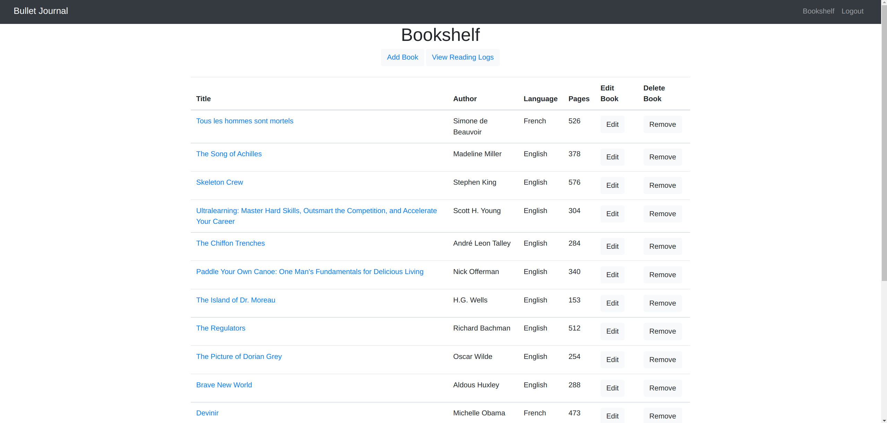
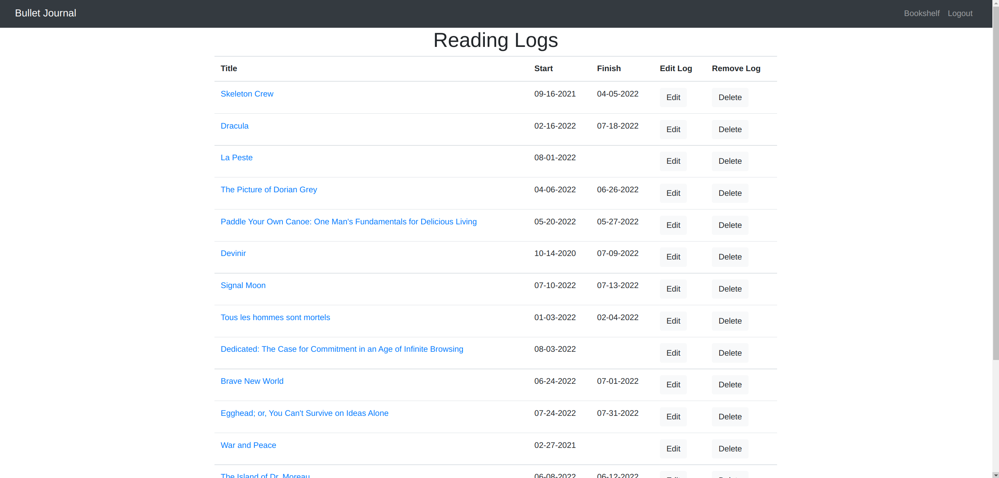
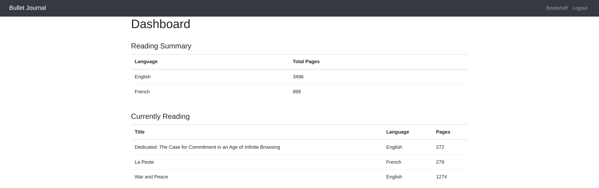

# Bullet Journal Application
Keep track of reading habits using the Bookshelf. Includes a summary of
activities, including reading habits by language and a list of in progress books.

##### View your Bookshelf

##### Track your Reading

##### Populates a Summary of Reading Habits

### Technologies
- Spring Boot, Spring Security, Maven
- PostreSQL, JPA (Hibernate), Jasypt encryption
- JUnit Jupiter, Mockito/BDD Mockito
- Thymeleaf, Bootstrap 4, HTML

### Process Analysis
- Utilizes behavior-driven development to execute testing with BDD Mockito, which defines
  behavior of repositories and isolates testing of the service layer functionality requirements
- Hypermedia driven RESTful API provides dynamic information with link relations to facilitate
  interaction using [Spring Data REST](https://docs.spring.io/spring-data/rest/docs/current/reference/html/)
- Extracted HTML head and header using
  [Thymeleaf fragments](https://www.thymeleaf.org/doc/articles/layouts.html#fragment-expressions)
- Updated Spring Security configuration to remove depreciated
  WebSecurityConfigurerAdapter and replace with SecurityConfig class using
  SecurityFilterChain. Utilized guide from [CodeJava](https://www.codejava.net/frameworks/spring-boot/fix-websecurityconfigureradapter-deprecated)
  and maintained PasswordConfig class for password configuration bean to
  resolve circular dependencies.

### Target Process
- Add collection of quotes to optionally reference books on a user's bookshelf

### Functional Requirements
- RESTful API
- Integration of [Spring Security](https://spring.io/projects/spring-security)
- Create, view, update and delete both books and their reading logs
- Uses [PostreSQL](https://www.postgresql.org/) database

### Non-Functional Requirements
- Improved look and feel with
  [Bootstrap 4](https://getbootstrap.com/docs/4.0/getting-started/introduction/) UI

### Resources
[Adding a PostgreSQL Database to a Spring Project](https://oneexists.github.io/java/2022-07-20-spring_postgres.html)

[Implementing the Factory Pattern](https://oneexists.github.io/java/2022-07-05-factory-pattern.html)
